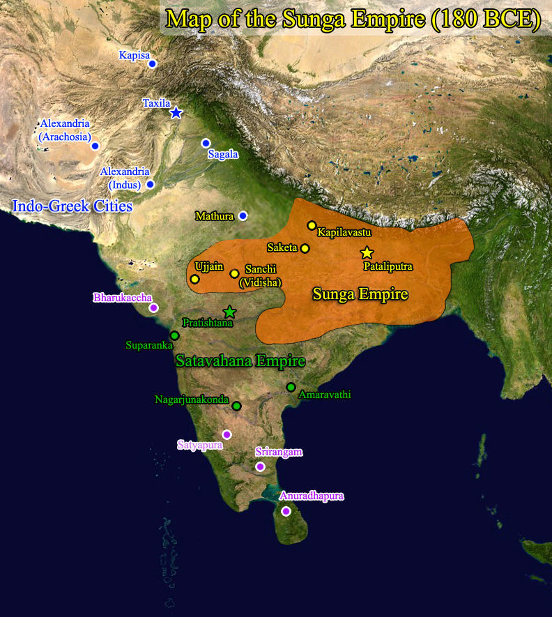
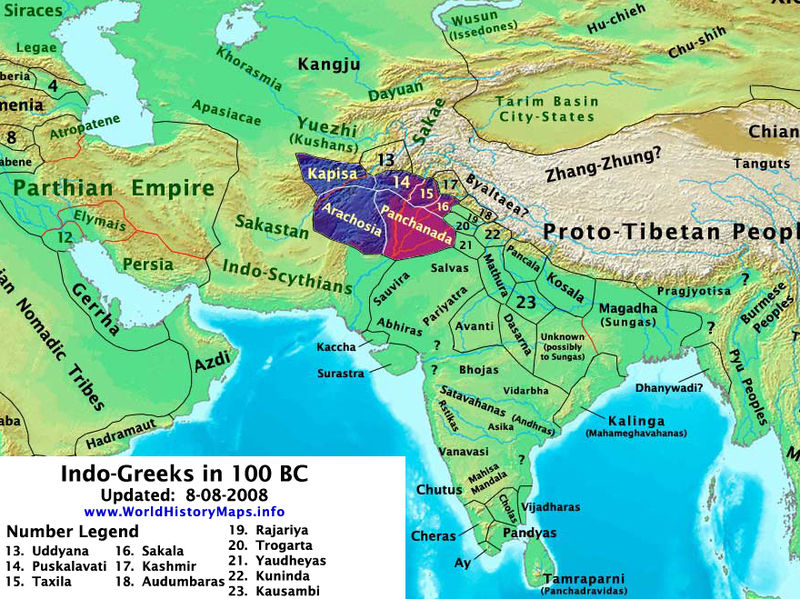
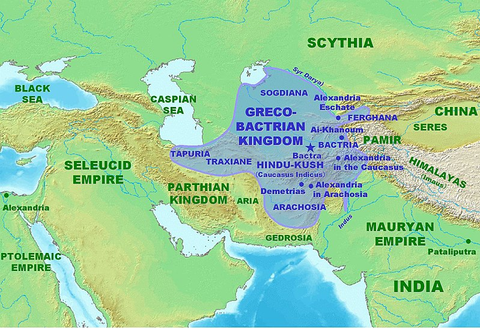
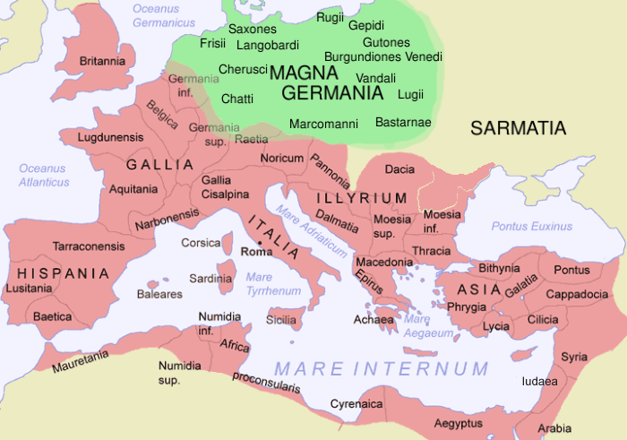

# Culture Packs 

## Bactria

[Shunga Empire](https://en.m.wikipedia.org/wiki/Shunga_Empire)

[Indo-Greek Kingdom](https://en.m.wikipedia.org/wiki/Indo-Greek_Kingdom)

[Greco-Bactrian](https://en.m.wikipedia.org/wiki/Greco-Bactrian_Kingdom)

### Central Asia
- Indo-Greeks
- Indo-Scythians
- Parthian Empire
- Dayuan
- Yuezhi/Tocharians
- Saka 

### South Asia
- Shunga Empire
- Satavahana Empire
- Cholas
- Pandyan
- Tibetans

## Eastern Tribes
- Han
- Xiongnu
- Xianbei
- Donghu
- Yuezhi

## Steppe Wars

- Scythians
- Sarmatians
- Xiongnu
- Saka
- Massagetae
- Yuezhi

## Baltic Tribes

[Thracian Tribes](http://home.exetel.com.au/thrace/tribes_main.htm)
- Scordisci
- Thracian
- Dacian
- Illyrian
- Paeonians
- Romans(Republican)
- Dalmatians
- Macedonians
- Dardanians
- Triballi
- Moesians
- Autariatae
- Maedi(Thracian)
- Agrianes
- Kingdom of Pontus

## Germania

https://cgiarcsi.community/data/srtm-90m-digital-elevation-database-v4-1/
http://srtm.csi.cgiar.org/srtmdata/

